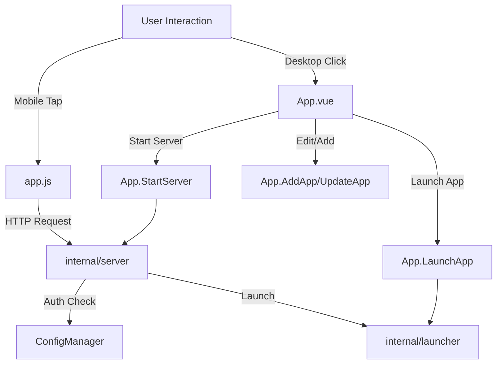

# Aviator Codebase Structure Analysis

## 1. Backend Analysis (Go)

The backend is built with Wails, serving as both the application core and a local HTTP server for the web interface.

### `main.go` (Entry Point)
- `main()`: Initializes config, assets, process monitor, server, and Wails app.
- `ensureSingleInstance()`: Uses Windows mutex to prevent multiple instances.
- `NewProcessMonitor()`: Helper to init process monitoring.
- **System Tray Logic**: Implements a tray icon with "Show", "Start/Stop Server", and "Quit" options.

### `app.go` (Application Logic & Wails Bindings)
This struct is bound to the frontend and exposes methods:
- **Lifecycle**: `startup`, `shutdown`, `AllowClose`.
- **Server Control**: `StartServer`, `StopServer`, `IsServerRunning`, `GetServerInfo`.
- **App Management**: `GetApps`, `AddApp`, `UpdateApp`, `RemoveApp`.
- **Launcher**: `LaunchApp` (Triggers execution), `SelectFile` (Native dialog).
- **Monitoring**: `monitorProcesses` (Background goroutine), `GetProcessStatuses`.
- **Settings/Security**: `GetSettings`, `UpdateSettings`, `SetWebPIN`, `GetVersion`.
- **Context**: `Show`, `Hide`.

### `internal/server/server.go` (HTTP Server)
Handles the web interface logic (`http://localhost:8000`).
- `Start/Stop`: Manages `http.Server`.
- `ServeHTTP`: Middleware for CORS, caching, and routing.
- **API Endpoints**:
    - `GET /ping`: Health check.
    - `GET /api/info`: Server status and version.
    - `GET /api/apps`: List configured apps (Auth required).
    - `POST /api/launch/{id}`: Launches an app (Auth required).
    - `GET /api/process-statuses`: Returns running pids (Auth required).
    - `POST /api/auth`: Validates PIN and sets cookie.
    - `POST /api/logout`: Clears session.
- **Security**: `isAuthorized` checks for valid session cookie/PIN.

---

## 2. Frontend Analysis

### Desktop UI (`frontend/src`)
Built with Vue 3 + Tailwind.
- `main.js`: Mounts `App.vue`.
- `App.vue`:
    - **UI**: Custom window frame (Maximize/Minimize/Close).
    - **Server Control**: toggle to start/stop the internal HTTP server.
    - **QR Code**: Generates QR for mobile access.
    - **App Grid**: Displays apps, allows Edit/Delete/Launch.
    - **Settings**: Manages Auto-Start and PIN configuration.
    - **Calls**: Heavily relies on `window.runtime` and `window.go.main.App` methods.
- **Style**: `style.css` (Tailwind directives).

### Web Interface (`internal/web/static`)
Vanilla JS + HTML for lightweight mobile access.
- `index.html`:
    - **Login Overlay**: PIN entry.
    - **App Grid**: Responsive grid of apps.
    - **App Details**: Modal with "Launch" button.
- `app.js`:
    - `fetchInfo()`: Checks server status & auth.
    - `handleLogin()`: Authenticates via `/api/auth`.
    - `fetchApps()`: Loads app list.
    - `launchApp()`: POSTs to `/api/launch`.
    - `updateServerStatus()`: Manages online/offline UI states.
    - **Polling**: Updates process status every 2s.
- **Style**: `styles.css` (Custom glassmorphism styles) + `led-styles.css` (Indicator lights).

---

## 3. Deep Scan Results: Unused Code & Cleanups

### Unused Files
1.  **`frontend/src/components/HelloWorld.vue`**: Classic Wails template component. Not imported in `App.vue`. **Safe to delete.**
2.  **`frontend/src/assets`**: Check if default Wails assets exist here and are unused.

### Potential Cleanups
- **`app.js`**: `connectWebSocket()` was removed in a previous step, verifying no lingering references.
- **`styles.css`**: Check for unused legacy classes if the design has shifted significantly.

## 4. Call Tree Summary

